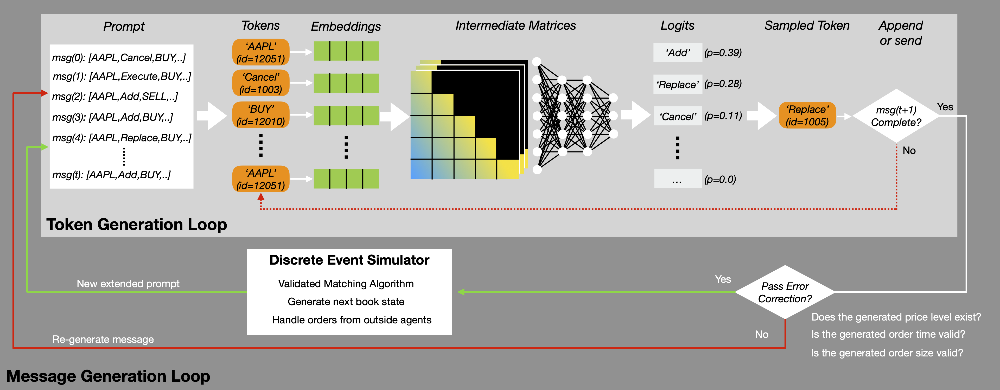

# MarketGPT
This repository provides the implementation for the paper:

> **MarketGPT: Developing a Pre-trained transformer (GPT) for Modeling Financial Time Series**\
> Aaron Wheeler, Jeffrey D. Varner\
> arXiv preprint: https://arxiv.org/abs/2411.16585



MarketGPT is a simulation platform that uses a generative pre-trained transformer (GPT) to generate realistic order flow within a discrete event simulator. Our model leverages recent advancements in large language models to produce long sequences of order messages in a steaming manner. Our results show that our model reproduces several features of order flow data, even well after the initial prompt is evicted from the model's context window. This work represents an important step towards the development of more realistic and data-driven market simulators that can be used for a variety of applications in finance and beyond.

This platform builds on prior work—most notably the tokenization scheme proposed by Nagy et al. ([paper](https://arxiv.org/abs/2309.00638)) and the ABIDES simulator framework (available [here](https://github.com/jpmorganchase/abides-jpmc-public)).

## Requirements & Installation

To install required packages, run `pip install -r requirements.txt`.

If you want to run the model or do any training, you will need a NVIDIA GPU to utilize PyTorch with CUDA support.

Additional notes for trouble-shooting installation and reproducibility issues: my development environment consisted of Ubuntu 22.04.5 LTS, python 3.11.8, and CUDA version 12.2 (Driver version 535).

## Data Download

The model weights and config that were used to generate all the results given in the paper (`ckpt_finetune_AAPL_v3.pt`) are publically available on Hugging Face: https://huggingface.co/aaronwheeler/MarketGPT-100m

All simulated data that was used for the evaluation of the model is provided in the `eval/simulated` folder. The empirical data that was used in the evaluation process will have to be downloaded manually (and placed in a `eval/empirical` folder if you want to run the eval notebook). The following empirical datasets were used for the model evaluation described in the paper:
* Reconstructed message file: `12302019.NASDAQ_ITCH50_AAPL_message.csv`
* Reconstructed book file: `12302019.NASDAQ_ITCH50_AAPL_book_20.csv`
* Pre-processed message file: `12302019.NASDAQ_ITCH50_AAPL_message_proc.npy`

These files and all others used in the pre-training, finetuning, and testing of the model are also available on Hugging Face: https://huggingface.co/datasets/aaronwheeler/MarketGPT-datasets

**To download raw data from the source and pre-process it yourself**:\
The raw data used in this work was Nasdaq TotalView-ITCH 5.0 data feed messages, which are available through a public ftp at [ftp://emi.nasdaq.com/ITCH/](https://emi.nasdaq.com/ITCH/Nasdaq%20ITCH/). A reconstructor is needed to process these compressed files and output two CSV files for each unique stock: one file containing the messages and one containing the related limit order book. The reconstructor used in the study is my fork of the ITCH repo, which is available [here](https://github.com/aaron-wheeler/ITCH) (it contains an additional script for processing multiple symbols at a time).

Once reconstructed, these CSV files will need to be pre-processed for model training. This is accomplished by the `equities/data_processing/itch_multi_preproc.py` script. An example command is as follows:

```sh
python equities/data_processing/itch_multi_preproc.py --skip_existing --messages_only --remove_premarket --remove_aftermarket
```

## Repository Structure

Notable directories and files that ship with GitHub repo:
```
equities/               Source code for GPT models, data processing, etc.
    data_processing/        Dataset preparation
        itch_encoding.py        Message tokenization: encoding and decoding
        itch_multi_preproc.py   Pre-processes ITCH data for the model
    fast_model.py           Defines full GPT model
    fast_train.py           Training loop code
    train_sweep.py          Hyperparamter sweep (WanDB)
notebooks/              Various notebooks for interacting with models, etc.
    simulate.ipynb          Run model inference with trained GPT and DES
eval/                   Model evaluation and utils
    MarketGPT_plots.ipynb   Model validation and plotting of results
simulator/              Discrete event simulator (DES)
ssm/                    Source code for Mamba model
tokenizer/              Source code for BPE tokenizer
out/                    Model checkpoints and LogBook
config/                 Configuration files
    fast_model.yaml         WanDB sweep parameters
requirements.txt        Package requirements
```
There are more files present in the repo than what is listed here. Many are still a work in progress (e.g., recurrent/Mamba based models and multi-stock simulation).

## Experiments & Results

Experiments were conducted using the `notebooks/simulate.ipynb` file. This file loads a trained model and interacts with the simulator for a designated number of steps. All experiment data is collected after the simulation terminates. The analysis, calculation, and plotting of results were conducted in the `eval/MarketGPT_plots.ipynb` file.

## Citation

Please use the following to cite our work:
```
@article{wheeler2024,
  url = {https://arxiv.org/abs/2411.16585},
  author = {Aaron Wheeler and Jeffrey D. Varner},
  title = {MarketGPT: Developing a Pre-trained transformer (GPT) for Modeling Financial Time Series},
  publisher = {arXiv},
  year = {2024},
  copyright = {Creative Commons Attribution 4.0 International}
}
```

Please reach out if you have any questions.
